# TỔNG HỢP CHI TIẾT NỘI DUNG SLIDE & KỊCH BẢN THUYẾT TRÌNH CUỐI KỲ (MVP MOTCHI)
> **Tài liệu nguồn:** `fix.md`, `MVP資料_木2_モチ.xlsx`, `16_最終発表の事前案内.pdf`  
> **Mục tiêu:** Tài liệu toàn diện hướng dẫn thiết kế Slide (Japanese only trên màn hình) kèm kịch bản thuyết trình song ngữ (Nhật - Việt) và hướng dẫn Q&A chuẩn yêu cầu của giáo viên.

---

## 0. CÁC ĐIỂM CỐT LÕI ĐỂ ĐẠT ĐIỂM CAO (ĐÁNH GIÁ CUỐI KỲ)
*   **Problem–Solution Fit:** Vấn đề không đơn thuần là "sinh viên lười học ngoại ngữ". Vấn đề chính xác là: *Sinh viên Đại học Bách khoa Hà Nội rất bận rộn với deadline môn chuyên ngành; họ thiếu một công cụ micro-learning linh hoạt, dễ rơi vào trạng thái trì hoãn và hối hận, đồng thời các phương pháp tạo thẻ từ vựng thủ công (Quizlet, flashcard giấy) rất mất thời gian.*
*   **Giải pháp phải tương thích tuyệt đối với vấn đề:**
    *   *Bận rộn* → Học micro-learning siêu ngắn (5-10 phút), tận dụng thời gian rảnh.
    *   *Tạo thẻ thủ công mất thời gian* → Tự động trích xuất từ vựng từ văn bản dán vào (Extract Word).
    *   *Học xong dễ quên* → Kết hợp Flashcard và Mini Test kiểm tra ngay lập tức.
    *   *Học ngoại ngữ cần phát âm* → Tích hợp tính năng phát âm bản xứ (TTS).
    *   *Cần sự linh hoạt theo thời gian rảnh* → Cho phép tùy chỉnh số câu hỏi Mini Test.
*   **Demo theo câu chuyện (Storytelling):** Không giới thiệu tính năng khô khan theo kiểu "đây là nút A, đây là nút B". Phải demo qua tình huống cụ thể: *"Một sinh viên sắp có bài kiểm tra từ vựng, không có thời gian gõ từng từ tạo flashcard, đã sử dụng Mochi để dán bài đọc → trích xuất từ vựng → học qua flashcard kèm nghe phát âm → làm mini test 5 câu nhanh gọn → xem kết quả để ôn lại từ sai."*
*   **Slide trình chiếu:** Chỉ hiển thị **tiếng Nhật hoàn toàn** trên màn hình để chuyên nghiệp. Phần tiếng Việt được để trong Speaker Notes để nhóm đọc hiểu và luyện tập.

---

## 1. PHÂN CHIA BỐ CỤC THUYẾT TRÌNH (12 PHÚT)

```mermaid
gantt
    title Bố cục thuyết trình 12 phút
    dateFormat  X
    axisFormat %s
    section Mạnh
    Phần 1: Vấn đề & Thách thức (Slides 1-5) : 0, 4
    section Giáp
    Phần 2: Giải pháp & MVP (Slides 6-9) : 4, 8
    section Diện
    Phần 3: Demo thực tế & Q&A (Slides 10-12) : 8, 12
```



### Phân công vai trò trong nhóm:
*   **Diễn giả (Speakers):** 3 thành viên (Mạnh, Giáp, Diện) phụ trách thuyết trình 3 phần, mỗi phần 4 phút.
*   **Vận hành máy (Operator):** 1 thành viên chịu trách nhiệm chuyển slide và thao tác trực tiếp màn hình demo.
*   **Quản lý thời gian (Timekeeper):** 1 thành viên bấm giờ chính xác từng phần.
*   **Trả lời câu hỏi (Q&A Team):** Ít nhất 2 thành viên chuẩn bị tài liệu Q&A và ứng biến trả lời câu hỏi của giáo viên/các nhóm khác.

---

## 2. CHI TIẾT NỘI DUNG TỪNG SLIDE (12 SLIDES)

### SLIDE 1 — タイトル (TRANG TIÊU ĐỀ)
*   **Ý tưởng thiết kế & Gợi ý hình ảnh (Visuals):**
    *   Thiết kế giao diện Dark Mode cao cấp (màu tím/xanh đậm kết hợp hiệu ứng kính mờ Glassmorphism).
    *   Logo Mochi nổi bật và đồ họa mô phỏng luồng học 3 bước tối giản.
*   **Nội dung hiển thị trên Slide (Tiếng Nhật):**
    ```text
    モチ
    スキマ時間で外国語の語彙を学べる
    マイクロラーニングアプリ
    チーム：モチ
    ```
*   **Dịch nghĩa (Tiếng Việt):**
    ```text
    Mochi
    Ứng dụng micro-learning giúp học từ vựng ngoại ngữ trong thời gian rảnh ngắn
    Nhóm: Mochi
    ```
*   **Kịch bản nói (Presenter - Mạnh):**
    *   **日本語:** 皆さん、こんにちは。私たちはチーム「モチ」です。今日は、外国語の語彙学習をサポートするMVPについて発表します。
    *   **Tiếng Việt:** Xin chào mọi người. Chúng tôi là nhóm “Mochi”. Hôm nay, chúng tôi sẽ trình bày về dự án phát triển MVP hỗ trợ học từ vựng ngoại ngữ.

---

### SLIDE 2 — ターゲットユーザー (NGƯỜI DÙNG MỤC TIÊU)
*   **Ý tưởng thiết kế & Gợi ý hình ảnh (Visuals):**
    *   Sử dụng icon hình người đại diện cho sinh viên Bách Khoa (đeo balo, bận rộn, sử dụng điện thoại/laptop).
*   **Nội dung hiển thị trên Slide (Tiếng Nhật):**
    ```text
    ターゲットユーザー
    ・ハノイ工科大学の学生
    ・外国語を勉強している学生
    ・課題や専門科目で忙しい学生
    ・短い時間で語彙を復習したい学生
    ```
*   **Dịch nghĩa (Tiếng Việt):**
    ```text
    Người dùng mục tiêu
    ・Sinh viên Đại học Bách khoa Hà Nội
    ・Sinh viên đang học ngoại ngữ
    ・Sinh viên bận với bài tập lớn và môn chuyên ngành
    ・Sinh viên muốn ôn từ vựng nhanh trong thời gian ngắn
    ```
*   **Kịch bản nói (Presenter - Mạnh):**
    *   **日本語:** 私たちのターゲットユーザーは、ハノイ工科大学の学生です。特に、外国語を勉強しているけれど、課題や専門科目で忙しい学生を対象にしています。
    *   **Tiếng Việt:** Người dùng mục tiêu của chúng tôi là sinh viên Đại học Bách khoa Hà Nội. Đặc biệt là những sinh viên đang tự học ngoại ngữ nhưng vô cùng bận rộn với các bài tập lớn và môn chuyên ngành.

---

### SLIDE 3 — 問題 (VẤN ĐỀ CỦA NGƯỜI DÙNG)
*   **Ý tưởng thiết kế & Gợi ý hình ảnh (Visuals):**
    *   Hình ảnh một cuốn lịch chi chít lịch thi và deadline đè lên biểu tượng học ngoại ngữ.
    *   Sử dụng các mũi tên chỉ ra 3 nguyên nhân chính tạo nên sự trì hoãn.
*   **Nội dung hiển thị trên Slide (Tiếng Nhật):**
    ```text
    問題
    ハノイ工科大学の学生は、外国語学習を続けたいと思っていても、
    忙しいスケジュールの中で学習を後回しにしやすい。

    主な原因：
    ・まとまった学習時間がない
    ・手動で単語カードを作るのが面倒
    ・学習を続けるモチベーションが下がりやすい
    ```
*   **Dịch nghĩa (Tiếng Việt):**
    ```text
    Vấn đề
    Sinh viên Bách khoa dù muốn tiếp tục học ngoại ngữ, nhưng trong lịch học bận rộn,
    họ rất dễ trì hoãn việc học sang một bên.

    Nguyên nhân chính:
    ・Không có thời gian học dài tập trung
    ・Việc tạo flashcard thủ công rất tốn thời gian
    ・Động lực học tập dễ bị suy giảm
    ```
*   **Kịch bản nói (Presenter - Mạnh):**
    *   **日本語:** プロブレムインタビューを通して、多くの学生は外国語学習を続けたいと思っていても、忙しいスケジュールの中で学習を後回しにしやすいことが分かりました。原因は主に三つあります。一つ目は、まとまった学習時間がないことです。二つ目は、単語カードを手動で作るのが面倒なことです。三つ目は、学習を続けるモチベーションが下がりやすいことです。
    *   **Tiếng Việt:** Thông qua phỏng vấn vấn đề, chúng tôi nhận thấy nhiều sinh viên dù rất muốn học ngoại ngữ, nhưng trong lịch trình bận rộn, họ dễ trì hoãn việc học. Nguyên nhân chính có ba điểm: Thứ nhất, họ không có thời gian học dài tập trung. Thứ hai, việc tự tạo thẻ từ vựng thủ công rất mất công. Thứ ba, động lực học dễ bị giảm sút.

---

### SLIDE 4 — インタビューから分かったこと (INSIGHTS TỪ PHỎNG VẤN VẤN ĐỀ)
*   **Ý tưởng thiết kế & Gợi ý hình ảnh (Visuals):**
    *   Biểu đồ cột hoặc infographic làm nổi bật con số **55%** (Hối hận/Regret) và **44%** (Xao nhãng/Distracted).
*   **Nội dung hiển thị trên Slide (Tiếng Nhật):**
    ```text
    インタビュー結果
    ・多くの学生が学習を先延ばしにした後、後悔を感じている
    ・集中力が切れやすいという声が多かった
    ・現在の学習方法の満足度は高くない
    ・学生は短時間で使える学習方法を求めている
    ```
*   **Dịch nghĩa (Tiếng Việt):**
    ```text
    Kết quả phỏng vấn vấn đề
    ・Nhiều sinh viên cảm thấy hối hận, tội lỗi sau khi trì hoãn việc học
    ・Nhiều người phản hồi rằng dễ bị xao nhãng bởi môi trường
    * Mức hài lòng với cách học hiện tại chưa cao (chỉ 5-7/10 điểm)
    ・Sinh viên rất cần một cách học nhanh có thể dùng trong thời gian ngắn
    ```
*   **Kịch bản nói (Presenter - Mạnh):**
    *   **日本語:** インタビューでは、学習を先延ばしにした後に後悔を感じる学生や、集中力が切れやすいと感じる学生が多くいました。現在の学習方法に対する満足度も、あまり高くありませんでした。
    *   **Tiếng Việt:** Ngoài ra, qua phỏng vấn, có hơn 55% sinh viên cảm thấy hối hận sau khi trì hoãn việc học, và 44% cảm thấy dễ bị xao nhãng bởi môi trường xung quanh. Mức độ hài lòng với các phương pháp học hiện tại chỉ ở mức trung bình thấp.

---

### SLIDE 5 — 課題 (XÁC ĐỊNH THÁCH THỨC CỐT LÕI)
*   **Ý tưởng thiết kế & Gợi ý hình ảnh (Visuals):**
    *   Thiết kế tối giản, tập trung làm nổi bật câu Thách thức bằng cỡ chữ lớn (Typography nghệ thuật) để người nghe tập trung hoàn toàn vào thông điệp cốt lõi này.
*   **Nội dung hiển thị trên Slide (Tiếng Nhật):**
    ```text
    課題
    多忙なスケジュールの合間でも、
    プレッシャーを感じることなく、
    日常のスキマ時間を「自然な学びの時間」に変えること。
    ```
*   **Dịch nghĩa (Tiếng Việt):**
    ```text
    Thách thức
    Làm sao để sinh viên bận rộn không cảm thấy áp lực,
    và có thể biến thời gian rảnh ngắn hằng ngày thành “thời gian học tự nhiên”.
    ```
*   **Kịch bản nói (Presenter - Mạnh):**
    *   **日本語:** そこで、私たちは次の課題を設定しました。多忙なスケジュールの合間でも、プレッシャーを感じることなく、日常のスキマ時間を「自然な学びの時間」に変えることです。この課題を解決するために、私たちはMVP「モチ」を考えました。
    *   **Tiếng Việt:** Vì vậy, chúng tôi đặt ra thách thức cốt lõi: Làm thế nào để ngay cả khi lịch trình bận rộn, sinh viên không cảm thấy áp lực mà vẫn có thể biến các khoảng thời gian rảnh ngắn hằng ngày thành “thời gian học tập tự nhiên”. Để giải quyết thách thức này, chúng tôi đã phát triển MVP “Mochi”.

---

### SLIDE 6 — 解決策 (GIẢI PHÁP - MOCHI)
*   **Ý tưởng thiết kế & Gợi ý hình ảnh (Visuals):**
    *   Hình vẽ chuỗi 3 bước khép kín: Paste Văn Bản → Tách Từ → Lật Thẻ → Làm Test.
    *   Giao diện ứng dụng Mochi mượt mà trên thiết bị di động/máy tính.
*   **Nội dung hiển thị trên Slide (Tiếng Nhật):**
    ```text
    解決策：モチ
    モチは、語彙学習を短く・簡単に・続けやすくする
    マイクロラーニングアプリです。

    ユーザーは文章を貼り付けるだけで、
    単語を抽出し、カードで学習し、
    ミニテストで確認できます。
    ```
*   **Dịch nghĩa (Tiếng Việt):**
    ```text
    Giải pháp: Mochi
    Mochi là ứng dụng micro-learning giúp việc học từ vựng ngắn hơn,
    đơn giản hơn và dễ duy trì hơn.

    Người dùng chỉ cần dán đoạn văn, ứng dụng sẽ trích xuất từ vựng,
    học nhanh bằng flashcard, và kiểm tra ngay bằng mini test.
    ```
*   **Kịch bản nói (Presenter - Giáp):**
    *   **日本語:** 次に、私たちの解決策について説明します。解決策は「モチ」です。モチは、語彙学習を短く、簡単に、続けやすくするマイクロラーニングアプリです。ユーザーは、学習したい文章をアプリに貼り付けます。すると、アプリが重要な単語を自動で抽出します。その後、ユーザーはフラッシュカードで単語と意味を確認し、ミニテストで理解度をチェックできます。
    *   **Tiếng Việt:** Tiếp theo, tôi xin trình bày giải pháp của nhóm. Giải pháp của chúng tôi là "Mochi". Mochi là ứng dụng học tập siêu ngắn giúp việc học từ vựng trở nên ngắn gọn, đơn giản và dễ duy trì hơn. Người dùng chỉ cần sao chép văn bản muốn học dán vào ứng dụng, hệ thống sẽ tự động tách các từ quan trọng để người dùng học qua thẻ flashcard và kiểm tra bằng bài test nhanh.

---

### SLIDE 7 — MVPの機能 (CÁC CHỨC NĂNG CỦA MVP)
*   **Ý tưởng thiết kế & Gợi ý hình ảnh (Visuals):**
    *   Thiết kế chia đôi slide: Một bên liệt kê "3 Chức năng chính" (có kèm 3 icon đặc trưng), bên còn lại liệt kê "2 Chức năng phụ/Cải tiến" (được đặt trong khung nhỏ hơn để thể hiện vai trò bổ trợ).
*   **Nội dung hiển thị trên Slide (Tiếng Nhật):**
    ```text
    MVPの機能
    【主要機能】
    1. 単語抽出機能
    2. フラッシュカード機能
    3. ミニテスト機能

    【補助機能・改善点】
    ・発音・読み上げ機能
    ・テスト問題数のカスタマイズ
    ```
*   **Dịch nghĩa (Tiếng Việt):**
    ```text
    Các chức năng của MVP
    【Chức năng chính】
    1. Trích xuất từ vựng tự động
    2. Flashcard lật thẻ 3D
    3. Mini test kiểm tra kiến thức

    【Chức năng phụ / Cải tiến】
    ・Phát âm / Đọc từ bản xứ
    ・Tùy chỉnh số lượng câu hỏi kiểm tra
    ```
*   **Kịch bản nói (Presenter - Giáp):**
    *   **日本語:** MVPの機能は主に三つの主要機能と二つの補助機能があります。主要機能は、単語抽出機能、フラッシュカード機能、そしてミニテスト機能です。また、ユーザーのフィードバックに基づいて、補助機能として発音・読み上げ機能と、テスト問題数のカスタマイズ機能を追加しました。
    *   **Tiếng Việt:** MVP của chúng tôi tập trung vào 3 chức năng chính: thứ nhất là trích xuất từ vựng tự động, thứ hai là thẻ ghi nhớ flashcard, và thứ ba là kiểm tra nhanh minitest. Ngoài ra, dựa trên phản hồi thực tế của người dùng, nhóm đã phát triển thêm 2 chức năng phụ hỗ trợ là phát âm giọng đọc bản xứ và tùy chỉnh số lượng câu hỏi kiểm tra.

---

### SLIDE 8 — なぜこの機能か (MỐI QUAN HỆ GIỮA CHỨC NĂNG VÀ THÁCH THỨC)
*   **Ý tưởng thiết kế & Gợi ý hình ảnh (Visuals):**
    *   Sơ đồ liên kết dạng mũi tên nối từ Thách thức (ở cột trái) sang Tính năng giải quyết (ở cột phải) để chứng minh tính hợp lý (Problem-Solution Fit).
*   **Nội dung hiển thị trên Slide (Tiếng Nhật):**
    ```text
    機能と課題の関係
    ・単語抽出  →  手動入力の手間を減らす（時間の節約）
    ・フラッシュカード  →  スキマ時間で語彙を確認できる
    ・ミニテスト  →  学習後すぐに理解度を確認できる
    ・発音機能  →  音声学習で暗記の質を高める
    ・問題数カスタム  →  忙しさに合わせた学習の提供
    ```
*   **Dịch nghĩa (Tiếng Việt):**
    ```text
    Mối liên hệ giữa chức năng và thách thức
    ・Trích xuất từ vựng  →  Giảm công sức và thời gian nhập liệu thủ công
    ・Flashcard  →  Hỗ trợ ôn từ vựng nhanh gọn trong thời gian rảnh
    ・Mini test  →  Đo lường mức độ hiểu bài ngay lập tức sau khi học
    ・Phát âm  →  Tăng cường chất lượng và khả năng ghi nhớ âm thanh
    ・Tùy chỉnh câu hỏi  →  Linh hoạt hóa bài học theo quỹ thời gian trống
    ```
*   **Kịch bản nói (Presenter - Giáp):**
    *   **日本語:** これらの機能は、ユーザーの課題に直接答えています。単語抽出により手動入力の手間を減らし、フラッシュカードとミニテストにより短時間での効率的な学習と確認ができます。発音機能は外国語学習の質を高め、問題数のカスタマイズは忙しいスケジュールに合わせるためのものです。
    *   **Tiếng Việt:** Mỗi chức năng được thiết kế để giải quyết triệt để một thách thức của người dùng. Trích xuất từ giúp giảm thời gian chuẩn bị học liệu; flashcard và minitest cho phép nạp từ và đánh giá nhanh; phát âm giúp học đúng giọng chuẩn; và tùy chọn câu hỏi giúp cá nhân hóa bài kiểm tra theo quỹ thời gian của mỗi sinh viên.

---

### SLIDE 9 — ソリューションインタビュー結果 (KẾT QUẢ KIỂM CHỨNG & CẢI TIẾN)
*   **Ý tưởng thiết kế & Gợi ý hình ảnh (Visuals):**
    *   Thống kê định lượng: **7/8** người đánh giá cao trích xuất từ, **8/8** muốn tiếp tục sử dụng.
    *   Một nhánh sơ đồ chỉ ra 3 cải tiến nhóm đã thực thi ngay lập tức dựa trên phản hồi của người dùng.
*   **Nội dung hiển thị trên Slide (Tiếng Nhật):**
    ```text
    ソリューションインタビュー結果
    ・7/8人が「単語抽出機能」に最も価値を感じた
    ・7/8人が語彙学習の課題を解決できると答えた
    ・8/8人が今後も使いたいと答えた

    改善した点：
    ・画面の文字を読みやすくするためコントラストを改善
    ・発音・読み上げ機能の追加
    ・ミニテストの問題数を選択可能に
    ```
*   **Dịch nghĩa (Tiếng Việt):**
    ```text
    Kết quả phỏng vấn giải pháp
    ・7/8 người dùng thấy chức năng trích xuất từ vựng có giá trị nhất
    ・7/8 người xác nhận MVP giải quyết tốt vấn đề học tập của họ
    ・8/8 người sẵn sàng tiếp tục sử dụng lâu dài

    Các điểm nhóm đã cải tiến:
    ・Tăng độ tương phản màu sắc để dễ đọc chữ trên giao diện tối
    ・Tích hợp thêm chức năng phát âm giọng nói bản xứ
    ・Cho phép tùy chỉnh linh hoạt số lượng câu hỏi kiểm tra
    ```
*   **Kịch bản nói (Presenter - Giáp):**
    *   **日本語:** ソリューションインタビューでは、8人中7人が単語抽出機能に最も価値を感じ、8人全員が今後も使いたいと答えました。一方で、画面が暗くて文字が見にくいという意見や、発音機能、問題数の変更機能がほしいという意見がありました。そのため、私たちはUIの色調を修正し、発音機能を追加し、問題数を選択できるように改善しました。
    *   **Tiếng Việt:** Qua phỏng vấn giải pháp trên 8 người dùng, 100% người dùng mong muốn sử dụng lâu dài và đánh giá cực kỳ cao tính năng trích xuất từ tự động. Nhận được phản hồi về việc giao diện tối khó nhìn chữ, thiếu phát âm và cần linh hoạt số câu hỏi, nhóm đã lập tức cập nhật tăng độ tương phản màu CSS, tích hợp giọng đọc TTS và bổ sung cấu hình bài test.

---

### SLIDE 10 — デモの場面 (TÌNH HUỐNG DEMO THỰC TẾ)
*   **Ý tưởng thiết kế & Gợi ý hình ảnh (Visuals):**
    *   Hình ảnh minh họa một sinh viên lo lắng nhìn vào bài đọc tiếng Anh/Nhật dài, đồng hồ chỉ ban đêm, ngày mai có bài kiểm tra từ vựng.
*   **Nội dung hiển thị trên Slide (Tiếng Nhật):**
    ```text
    デモの場面
    ある学生は、明日外国語の小テストがあります。
    しかし、長い文章から単語をまとめる時間がありません。

    そこで、モチを使って：
    ・短時間で単語を抽出する
    ・カードで効率的に学習する
    ・ミニテストで理解度を確認する
    ```
*   **Dịch nghĩa (Tiếng Việt):**
    ```text
    Tình huống Demo
    Một sinh viên ngày mai có bài kiểm tra ngoại ngữ.
    Tuy nhiên, bạn ấy không có thời gian để tự tổng hợp từ vựng từ bài đọc rất dài.

    Vì vậy, sinh viên này dùng Mochi để:
    ・Trích xuất nhanh các từ quan trọng trong 3 giây
    ・Học nhanh bằng thẻ flashcard
    ・Đo lường kiến thức bằng bài kiểm tra ngắn
    ```
*   **Kịch bản nói (Presenter - Diện):**
    *   **日本語:** それでは、デモを始めます。今回の場面は、ある学生が明日外国語の小テストを受けるという状況です。しかし、その学生は専門科目の課題で忙しく、長い文章から単語を一つ一つまとめる時間がありません。そこで、モチを使います。
    *   **Tiếng Việt:** Sau đây tôi xin bắt đầu phần demo thực tế của MVP. Tình huống giả định là một sinh viên ngày mai sẽ có bài kiểm tra từ vựng. Tuy nhiên, bạn ấy đang bị quá tải bởi các bài tập môn chuyên ngành và không có thời gian tự tra cứu và tạo thẻ từ vựng thủ công từ một bài đọc dài. Bạn ấy quyết định dùng Mochi để giải quyết vấn đề.

---

### SLIDE 11 — デモの流れ (LUỒNG THAO TÁC DEMO)
*   **Ý tưởng thiết kế & Gợi ý hình ảnh (Visuals):**
    *   Các bước thao tác được bố trí dưới dạng đường chạy tuyến tính.
    *   **Đặc biệt quan trọng:** Hiển thị 3 ảnh chụp màn hình thực tế (Screenshots) của ứng dụng để phòng trường hợp đường truyền mạng tại lớp gặp sự cố khi demo trực tiếp.
*   **Nội dung hiển thị trên Slide (Tiếng Nhật):**
    ```text
    デモの流れ
    1. 文章をコピーしてアプリに貼り付ける
    2. 単語を自動で抽出する
    3. フラッシュカードで学習し、発音を確認する
    4. ミニテストの問題数を設定して受ける
    5. テスト結果を確認し、間違えた単語を復習する
    ```
*   **Dịch nghĩa (Tiếng Việt):**
    ```text
    Luồng các bước Demo
    1. Sao chép và dán văn bản bài đọc vào ứng dụng
    2. Hệ thống tự động phân tích và trích xuất từ mới
    3. Học nghĩa từ qua Flashcard và nghe phát âm chuẩn
    4. Thiết lập số lượng câu hỏi và thực hiện Mini Test
    5. Xem kết quả chấm điểm tức thì và ôn tập từ sai
    ```
*   **Kịch bản nói (Presenter - Diện):**
    *   **日本語:** まず、ユーザーは学習したい文章をアプリに貼り付け、単語抽出ボタンを押します。アプリが文章の中から重要な単語を自動で抽出します。次に、抽出された単語をフラッシュカードで学習します。発音ボタンを押すことで、音声も確認できます。その後、自分の時間に合わせて問題数を選択し、ミニテストを受けます。テストが終わると、結果と間違えた単語を確認して復習します。
    *   **Tiếng Việt:** Đầu tiên, sinh viên dán văn bản bài đọc vào ứng dụng và nhấn nút Trích xuất. Hệ thống sẽ ngay lập tức tách ra các từ mới cần học. Tiếp đó, bạn học từ qua flashcard, nhấn biểu tượng loa để nghe giọng phát âm bản xứ. Cuối cùng, bạn chọn số lượng câu hỏi phù hợp với quỹ thời gian rảnh và làm bài test. Kết quả bài test hiển thị ngay lập tức giúp bạn nhận diện và ôn lại các từ bị sai.

---

### SLIDE 12 — まとめ (TỔNG KẾT SLIDE)
*   **Ý tưởng thiết kế & Gợi ý hình ảnh (Visuals):**
    *   Tóm tắt lợi ích lớn nhất bằng biểu đồ trực quan hoặc biểu tượng đồng hồ (tiết kiệm thời gian) và thẻ học tập.
    *   Trình bày trang nhã, để lại ấn tượng tốt đẹp cho người nghe.
*   **Nội dung hiển thị trên Slide (Tiếng Nhật):**
    ```text
    まとめ
    モチは、忙しい学生がスキマ時間を使って、
    外国語の語彙を学べるようにするアプリです。

    ・単語抽出により、学習開始までの手間を削減
    ・フラッシュカードとミニテストで短時間でのインプットとアウトプットを実現
    ・忙しい日常に自然な学習習慣を提供します
    ```
*   **Dịch nghĩa (Tiếng Việt):**
    ```text
    Tổng kết
    Mochi là ứng dụng micro-learning giúp sinh viên bận rộn học từ vựng ngoại ngữ
    trong thời gian rảnh ngắn một cách tự nhiên.

    ・Trích xuất từ giúp loại bỏ hoàn toàn công sức chuẩn bị bài học thủ công
    ・Flashcard và Mini Test kết hợp hài hòa quá trình nạp và kiểm tra kiến thức
    ・Mang lại thói quen tự học tự nhiên, không áp lực trong cuộc sống bận rộn
    ```
*   **Kịch bản nói (Presenter - Diện):**
    *   **日本語:** まとめです。モチは、忙しい学生がスキマ時間を使って、外国語の語彙を効果的に学べるようにするマイクロラーニングアプリです。単語抽出、フラッシュカード、ミニテストにより、準備の手間を減らし、短時間での復習を可能にします。発表は以上です。ご清聴ありがとうございました。
    *   **Tiếng Việt:** Tóm lại, Mochi mang đến trải nghiệm học từ vựng nhanh gọn, thực chất và phù hợp với lối sống bận rộn của sinh viên. Bằng cách kết hợp trích xuất tự động, thẻ flashcard lật và minitest, ứng dụng giúp giảm thiểu rào cản bắt đầu học. Phần trình bày của nhóm chúng em đến đây là kết thúc. Xin chân thành cảm ơn thầy và các bạn đã lắng nghe.

---

## 3. KỊCH BẢN DẪN DẮT TRẢI NGHIỆM THỰC TẾ (TRY APP)

*   **Thời gian:** 3 - 5 phút (nằm trong tổng thể khung giờ thuyết trình).
*   **Người thực hiện:** Người thuyết trình phần 3 (Diện) phối hợp cùng Operator gửi link.

### Thao tác chi tiết:
1.  **Gửi Link trên Slack:** Operator gửi URL ứng dụng lên kênh Slack của lớp học ngay khi bắt đầu Slide 11.
2.  **Thông báo mời trải nghiệm (Người nói đọc đoạn tiếng Nhật dưới đây):**
    *   **日本語:** SlackでアプリのURLを送りましたので、3分で自由に操作してみてください。特に、単語抽出、フラッシュカード、ミニテストを試してみてください。その後、フィードバックをお願いします。
    *   **Tiếng Việt:** Chúng tôi đã gửi URL ứng dụng trên Slack của lớp học, mời thầy và các bạn tự do thao tác trải nghiệm ứng dụng trong vòng 3 phút. Hãy tập trung dùng thử tính năng trích xuất từ, flashcard và bài minitest. Sau đó, rất mong nhận được góp ý của mọi người.
3.  **Tập hợp phản hồi và kết thúc trải nghiệm (Đọc khi hết giờ trải nghiệm):**
    *   **日本語:** 時間です。フィードバックと質問、ありがとうございます。これから回答させていただきます。
    *   **Tiếng Việt:** Đã hết thời gian trải nghiệm. Xin cảm ơn thầy và các bạn vì những phản hồi và câu hỏi gửi về cho nhóm. Sau đây, chúng tôi xin phép được trả lời các thắc mắc của mọi người.

---

## 4. BỘ CÂU HỎI Q&A DỰ PHÒNG CHUẨN BỊ TRƯỚC (ĐỌC HIỂU DÀNH CHO NHÓM)

### Câu hỏi 1: Sự khác biệt so với các sản phẩm đối thủ
*   **Q (日本語):** Quizletなどの既存アプリと何が違いますか。
*   **A (日本語):** 一番の違いは、単語抽出機能です。ユーザーは文章を貼り付けるだけで単語を抽出できるため、手動でカードを作る手間を減らせます。また、学習後すぐにミニテストで確認できる点も特徴です。
*   **Dịch tiếng Việt:**
    *   *Hỏi:* Ứng dụng này có gì khác biệt so với các sản phẩm có sẵn như Quizlet?
    *   *Đáp:* Điểm khác biệt lớn nhất là tính năng trích xuất từ vựng tự động. Người dùng chỉ cần dán đoạn văn để trích xuất từ mới trong vài giây, loại bỏ hoàn toàn việc gõ tay thủ công mất thời gian. Ngoài ra, việc tích hợp minitest ngay sau khi học flashcard giúp kiểm chứng kiến thức tức thì.

### Câu hỏi 2: Tại sao không đưa các tính năng thú ảo/game (Gamification) vào MVP
*   **Q (日本語):** なぜゲーミフィケーション機能を今回のMVPに入れなかったのですか。
*   **A (日本語):** インタビューではゲーム要素を求める意見もありました。しかし、今回のMVPでは、最初に定義した核心的な課題である「短時間で語彙学習を始められること」を優先しました。そのため、単語抽出、フラッシュカード、ミニテストを中心にしました。
*   **Dịch tiếng Việt:**
    *   *Hỏi:* Tại sao nhóm không tích hợp các tính năng game hóa (Gamification) hay nuôi thú cưng vào MVP lần này?
    *   *Đáp:* Mặc dù trong quá trình phỏng vấn có một số ý kiến đề xuất tích hợp game, nhưng trong phiên bản MVP này, nhóm quyết định ưu tiên giải quyết bài toán cốt lõi nhất đã định nghĩa ban đầu: “giúp sinh viên bận rộn bắt đầu học từ vựng nhanh chóng và ít áp lực nhất”. Vì vậy, chúng tôi tập trung tối đa nguồn lực làm mịn 3 tính năng: trích xuất từ, flashcard và minitest.

### Câu hỏi 3: Về việc phân loại cấp độ từ vựng (Leveling)
*   **Q (日本語):** 単語のレベル分け機能は実装しましたか。
*   **A (日本語):** 今回は実装していません。理由は、単語のレベルはユーザーが追加する時に自分で決められるためです。ただし、今後の改善案として、自動レベル分類を検討できます。
*   **Dịch tiếng Việt:**
    *   *Hỏi:* Nhóm đã triển khai chức năng phân chia cấp độ khó dễ của từ vựng chưa?
    *   *Đáp:* Trong MVP lần này chúng tôi chưa triển khai tính năng tự phân cấp độ. Lý do là độ khó hay cấp độ của từ vựng sẽ do chính người dùng chủ động lựa chọn khi họ thực hiện tick chọn từ từ văn bản trích xuất để thêm vào bộ thẻ học. Tuy nhiên, đây là một ý tưởng rất hay và chúng tôi sẽ cân nhắc tự động hóa phân cấp từ vựng bằng AI trong các phiên bản tiếp theo.

### Câu hỏi 4: Vấn đề duy trì động lực học lâu dài
*   **Q (日本語):** このMVPで本当にモチベーションを維持できますか。
*   **A (日本語):** 今回のMVPでは、モチベーション維持の前段階として、学習を始めるハードルを下げることを重視しました。単語抽出により準備時間を減らし、フラッシュカードとミニテストで短時間の学習を可能にします。これにより、毎日の学習を始めやすくなると考えています。
*   **Dịch tiếng Việt:**
    *   *Hỏi:* Liệu chỉ với các tính năng này thì ứng dụng có thực sự giúp người dùng duy trì động lực tự học lâu dài không?
    *   *Đáp:* Nhóm nhận định rằng trước khi nói về động lực lâu dài, rào cản lớn nhất khiến sinh viên bỏ cuộc là quá trình chuẩn bị học liệu quá phiền toái. Do đó, MVP tập trung làm giảm tối đa rào cản bắt đầu học bằng tính năng trích xuất từ tự động và gói gọn phiên học dưới 10 phút. Khi việc bắt đầu học trở nên quá dễ dàng và tiện lợi, người dùng sẽ tự động hình thành thói quen học tập hàng ngày một cách tự nhiên.

---

## 5. CHECKLIST TRƯỚC BUỔI THUYẾT TRÌNH (DÀNH CHO TEAM)
1.  [ ] **Đồng bộ ngôn ngữ trình chiếu:** Đảm bảo toàn bộ slide thật chỉ hiển thị chữ tiếng Nhật (không lồng chữ tiếng Việt lên màn hình để tránh làm loãng thiết kế).
2.  [ ] **Chuẩn bị Speaker Notes:** Đưa phần dịch tiếng Việt vào Speaker Notes trên Google Slides/PowerPoint để các thành viên hỗ trợ nhau khi thuyết trình.
3.  [ ] **Chạy thử Demo:** Người thuyết trình (Diện) cùng Operator chạy thử luồng demo thực tế trên ứng dụng ít nhất 2 lần trước giờ G.
4.  [ ] **Văn bản mẫu để Demo:** Chuẩn bị sẵn một đoạn văn bản mẫu (tiếng Nhật/tiếng Anh) ngắn gọn, sạch để dán vào khung trích xuất từ vựng (tránh việc lúc demo ngồi tìm kiếm văn bản).
5.  [ ] **Ảnh chụp màn hình dự phòng:** Chuẩn bị sẵn một slide phụ chứa ảnh chụp màn hình từng bước demo để chiếu thay thế trong trường hợp mạng lỗi không load được trang web.
6.  [ ] **Tập dượt Q&A:** Nhóm phản biện Q&A học thuộc và luyện nói trôi chảy các câu trả lời dự phòng bằng tiếng Nhật ở mục 4.
7.  [ ] **Kiểm soát tốc độ nói:** Các speaker luyện tập nói với tốc độ vừa phải, rõ chữ, phát âm tiếng Nhật chính xác để giáo viên có thể hiểu được trọn vẹn thông điệp.
8.  [ ] **Nhấn mạnh dữ liệu kiểm chứng:** Nhớ nói to, rõ ràng các chỉ số khảo sát thực tế: **7/8 người dùng**, **8/8 người tiếp tục sử dụng** để tăng tính thuyết phục của MVP.
